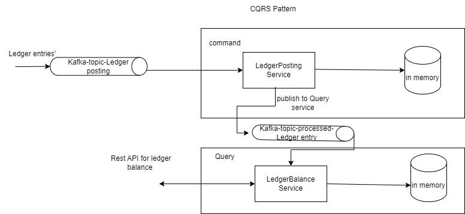

# Ledger Balance
- Swagger URL :http://localhost:9093/swagger-ui/index.html#/
- H2 db url:http://localhost:9093/h2-console/
- username/password - root-root

- Data replication not possible in local db, So processed ledger entry published to Query service(ledger Balance)
- account service not created separately. Assumed account schema available with command service(ledger posting)
